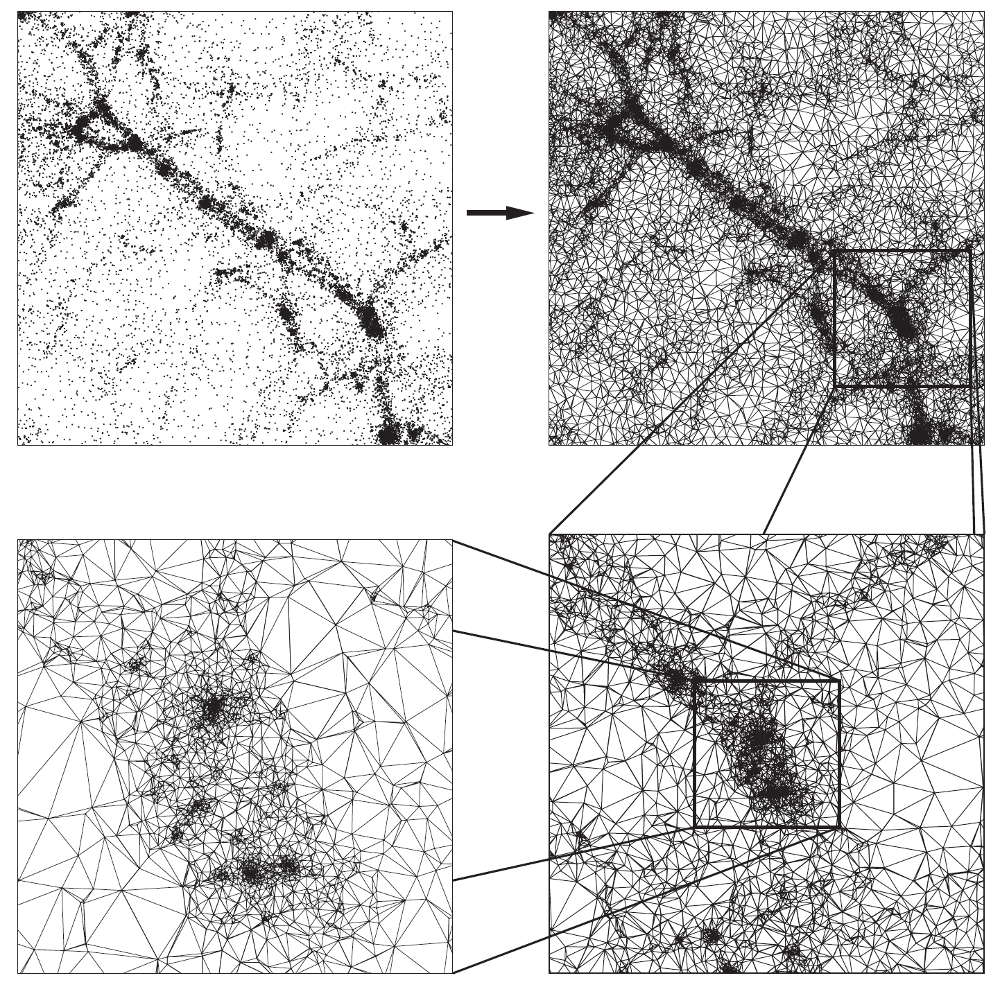
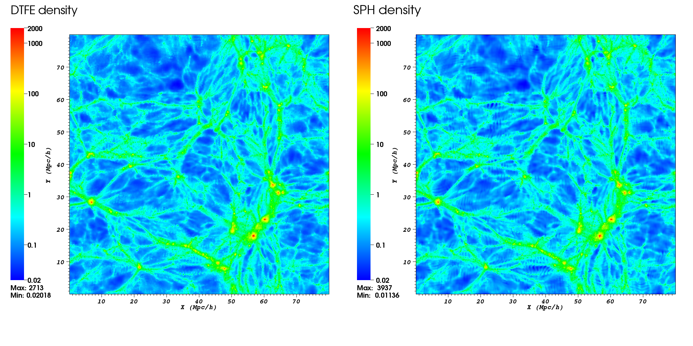
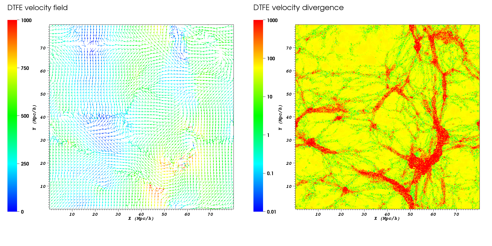

# The DTFE public software

The DTFE public code is a C++ implementation of the **Delaunay Tessellation Field Interpolation (DTFE)** method. Its purpose is to interpolate quantities stored at the location of an unstructured set of points to a regular grid using the maximum of information contained in the input points set. In particular, the code can calculate the following cosmological quantities:
* the density field - this is calculated directly from the point distribution,
* the velocity field and derivatives (e.g. gradient, divergence, vorticity) - uses the velocity at each particle position, and
* general vector quantities and their derivatives - these quantities must be given as input for each point in the set.

The code was written with the purpose of analysing cosmological simulations and galaxy redshift survey. Even though the code was designed with astrophysics in mind, it can be used for problems in a wide range of fields where one needs to interpolate from a discrete set of points to a grid.

The code was designed using a modular philosophy and with a wide set of features that can easily be selected using the different program options. The DTFE code is also written using OpenMP directives which allow it to run in parallel on shared-memory architectures.

The code comes with a complete [documentation](documentation/DTFE_user_guide.pdf) and with a multitude of examples that detail the program features. A test dataset and analysis of the code output is given in the [demo directory](demo).

The public release of the code is summarised in the arxiv publication [Cautun et al. (2011)](https://ui.adsabs.harvard.edu/abs/2011arXiv1105.0370C/abstract) and it is based on the method paper [Schaap and van de Weygaert (2000)](https://ui.adsabs.harvard.edu/abs/2000A%26A...363L..29S/abstract).

## The DTFE method
The Delaunay Tessellation Field Interpolation (DTFE) method represents the natural way of going from discrete samples/measurements to values on a periodic grid and it is especially suitable for astronomical data due to the following reasons:
* Preserves the multi-scale character of the point distribution. This is the case in numerical simulations of large scale structure where the density varies over more than 6 orders of magnitude.
* Preserves the local geometry of the point distribution. This is important in recovering sharp features like the different components of the cosmic web (i.e. clusters, filaments, walls and voids).
* The method does not depend on user defined parameters or choices.
* The interpolated fields are volume weighted (versus mass weighted quantities in most other interpolation schemes). This can have a significant effect especially when comparing with analytical predictions which are volume weighted.

For detailed information about the DTFE method see [Schaap and van de Weygaert (2000)](https://ui.adsabs.harvard.edu/abs/2000A%26A...363L..29S/abstract), [van de Weygaert and Schaap (2009)](https://ui.adsabs.harvard.edu/abs/2009LNP...665..291V/abstract), and [Cautun et al. (2011)](https://ui.adsabs.harvard.edu/abs/2011arXiv1105.0370C/abstract).

|  |
|:------:|
| Figure 1: *An illustration of the 2D Delaunay tessellation of a set of particles from a cosmological simulation. Courtesy: Willem Schaap.* |

|  |
|:------:|
| Figure 2: *An example of the DTFE density field form a cosmological simulation. The right panel shows the same result but now using the smoothed particle hydrodynamics (SPH) method.* |

|  |
|:------:|
| Figure 3: *A map of the DTFE computed velocity flow (left panel) and velocity divergence (right panel) corresponding to the density field shown in Figure 2.* |

## Summary of software features

* Works in both 2 and 3 spatial dimensions.
* Interpolates the fields to three different types of grids:
  + Regular rectangular and cuboid grid - useful for cosmological simulation.
  + Redshift cone (spherical coordinates) grid - useful for galaxy redshift survey or for mock observations.
  + User given sampling points - can describe any complex or non-regular sampling geometry
* Returns both the value at the centre of each cell of the interpolation grid as well as the value averaged over each cell.
* Uses the point distribution to compute the density and interpolates the result to grid.
* Each sample point has a weight associated to it to represent multiple resolution N-body simulations and observational biases for galaxy redshift surveys.
* Interpolates the velocity, velocity gradient, velocity divergence, velocity shear and velocity vorticity.
* Interpolates any additional number of fields and their gradients to grid.
* Periodic boundary conditions.
* Zoom in option for regions of interest.
* Splitting the full data in smaller computational chunks when dealing with limited CPU resources.
* The computation can be distributed in parallel on shared-memory architectures.
* For comparison purposes, the software comes also with three other simpler interpolation techniques: nearest grid point (NGP), triangular shape cloud (TSC; ) and smoothed particle hydrodynamics (SPH; )\citep{1992ARA&A..30..543M}.
* Returns the Delaunay tessellation of the given point set.
* Easy change of input/output data format.
* Easy to use as an external library.
* Extensive documentation of each feature.

## Contributors
* **Marius Cautun (Kapteyn Astronomical Institute, Durham University, Leiden University)** - *code and documentation.*
* **Rien van de Weygaert (Kapteyn Astronomical Institute)** - *various discussions about the method and implementation.*

## License

This project is licensed under GNU GENERAL PUBLIC LICENSE Version 3 - see the [LICENSE.md](LICENSE.md) file for details.
